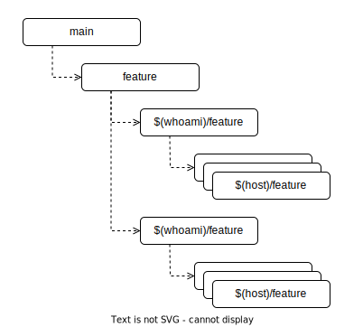

# Git cheatsheet

## Git workflow


### Start work on host
```
git fetch origin
git checkout -b $(hostname)/feat origin/feat
```
### List new changes on host
```
git log --oneline $(hostname)/feat ^origin/$(whoami)/feat
git log --oneline $(hostname)/feat ^origin/feat
```
### List new changes on origin
```
git log --oneline origin/$(whoami)/feat ^$(hostname)/feat
git log --oneline origin/feat ^$(hostname)/feat
```
### Save work on host
```
git tag $(hostname)/feat/$(date +%m-%d-%y) --message "saved work..."
```
### Transfer work to another host
```
git fetch origin
git rebase origin/$(whoami)/feat
git push origin HEAD:$(whoami)/feat --force
---
git fetch origin
git rebase origin/$(whoami)/feat
```
### Publish work
```
git fetch origin
git rebase origin/$(whoami)/feat
git rebase origin/feat
git push origin HEAD:$(whoami)/feat --force
git push origin HEAD:feat
```
### Publish subtree into another repo
```
git -C path/to/workspace subtree split --prefix=path/to/subtree -b subtree-branch
git push git@github.com:target-user/target-repo.git subtree-branch:target-branch
```
## Git useful aliases
```
alias.ll=log --oneline
alias.llf=log --oneline --name-only
alias.llr=log --oneline --reflog --graph
alias.bra=branch --all -v
alias.dfc=difftool --cached --tool=vimdiff
alias.df=difftool --tool=vimdiff
```
