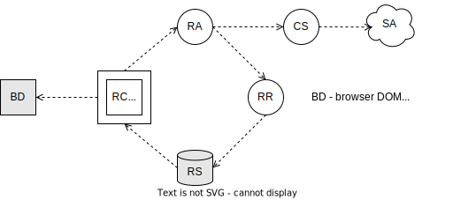

# React-Redux

[freeCodeCamp React-Redux](https://www.freecodecamp.org/learn/front-end-development-libraries/react-and-redux/)  

## Design


## Install
```
npm install react-redux
```
## Provide redux store to react component
```
import { Provider } from 'react-redux'

<Provider store={store}>
  <ComponentWrapper />
</Provider>
```
## Map store state and dispatch to react component
```
const mapStateToProps = (state) => ({ data: state.data, err: state.err })
const mapDispatchToProps = (dispatch) => ({
  fetchData(url) {
    dispatch({ type: 'LOADING' });
    fetch(url)
      .then(resp => { if (resp.ok) return resp.json(); throw Error(resp.statusText) })
      .then(data => dispatch({ type: 'LOADED', payload: { data } }))
      .catch(err => dispatch({ type: 'LOAD_ERR', payload: { err } }));
  }
});

const ComponentWrapper = ReactRedux.connect(mapStateToProps, mapDispatchToProps)(Component);

const Component = (props) => {
  const handleClick = () => { props.fetchData(url) };
  return (
    <>
      <button onClicked={handleClick}>Fetch</button>
      {props.data && <div className='data'>{props.data}</div>}
      {props.err && <div className='err'>{props.err}</div>}
    </>
  )
}
```
## Map dispatch to async actions through redux thunk
```
import ReduxThunk from 'redux-thunk'

// support async actions...

const store = Redux.createStore(reducer, Redux.applyMiddleware(ReduxThunk))

// async action through redux thunk...

const fetchData = (url) => (dispatch, getState) => {
  dispatch({ type: 'LOADING' });
  fetch(url)
    .then(data => dispatch({ type: LOADED, payload: { data } }))
    .catch(err => dispatch({ type: LOAD_ERR, payload: { err } }));
}

// map dispatch async action...

const mapDispatchToProps = (dispatch) => ({
  fetchData: (url) => dispatch(fetchData(url))
});
const ComponentWrapper = ReactRedux.connect(mapStateToProps, mapDispatchToProps)(Component);
```
